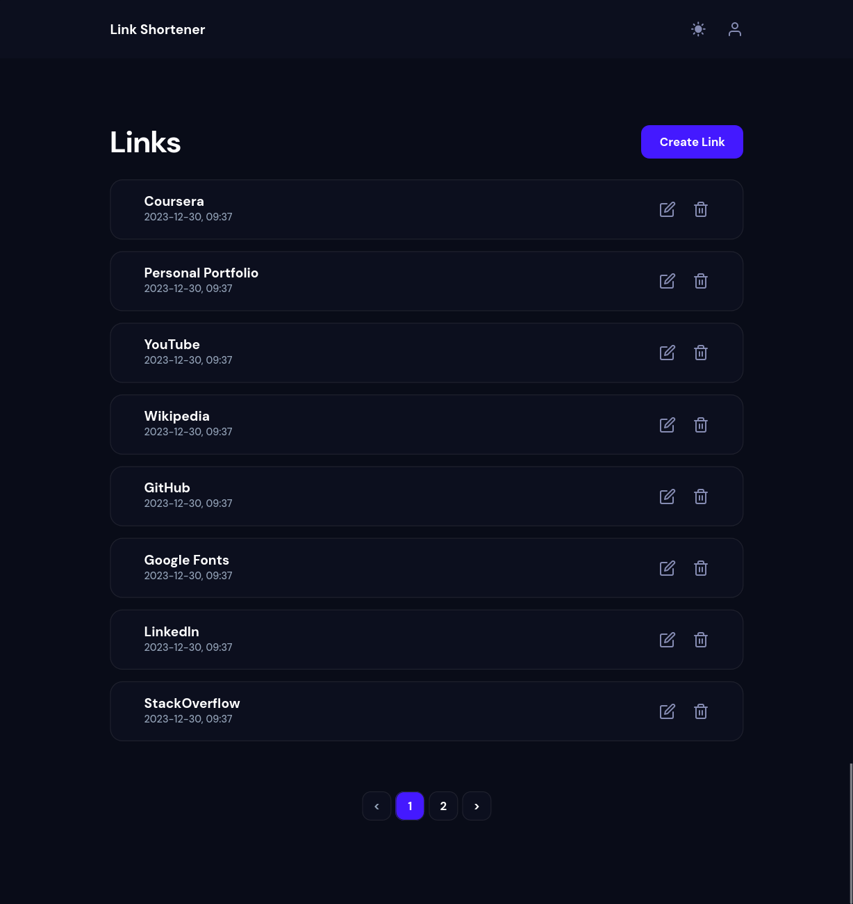
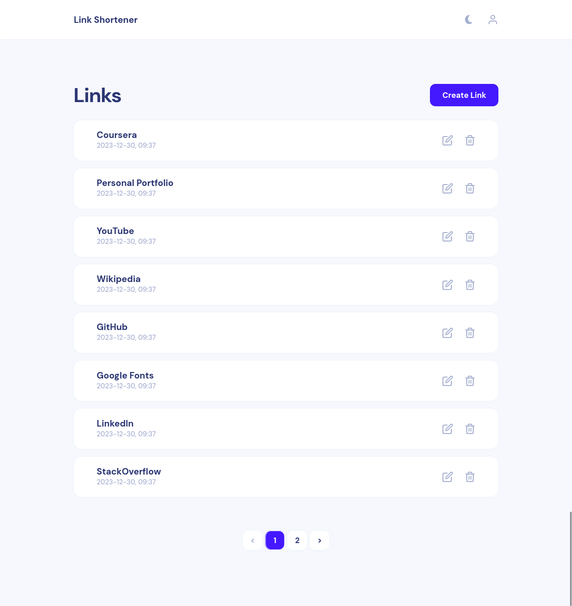
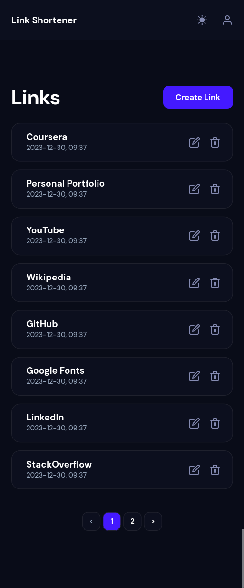
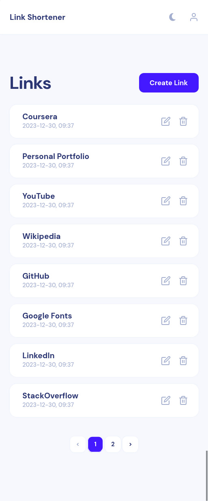
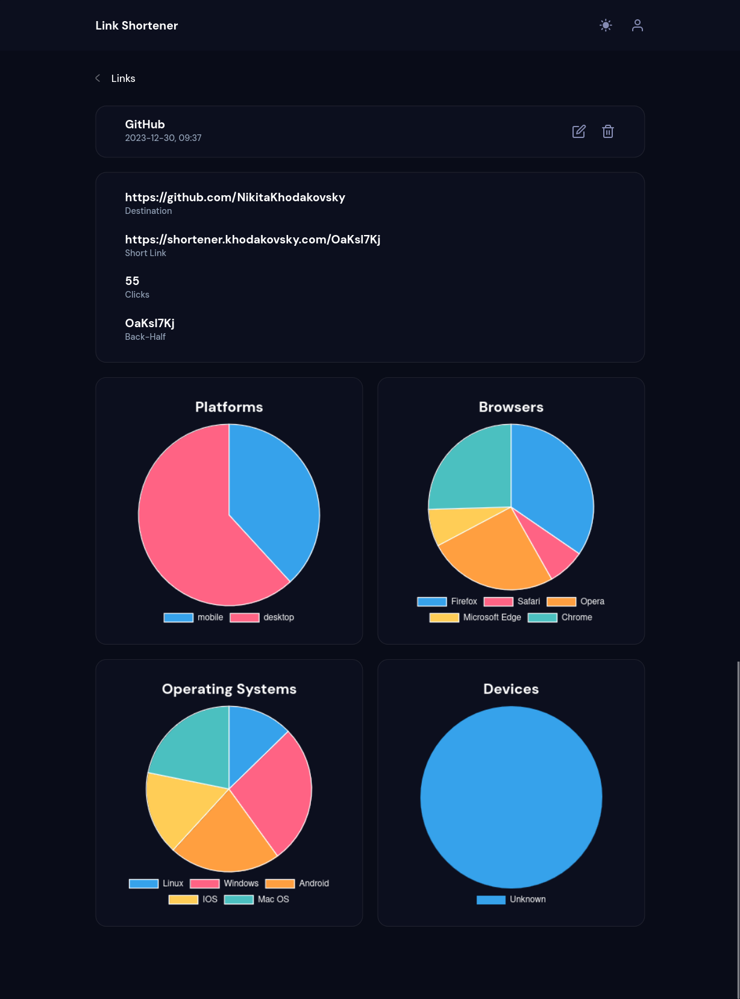
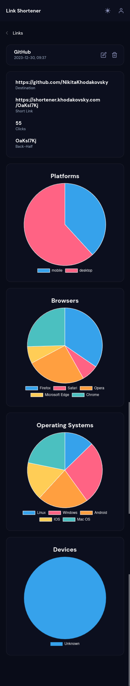
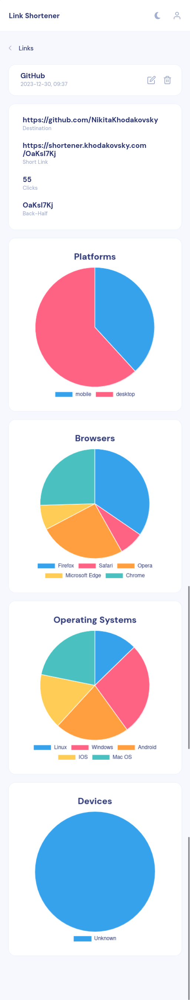
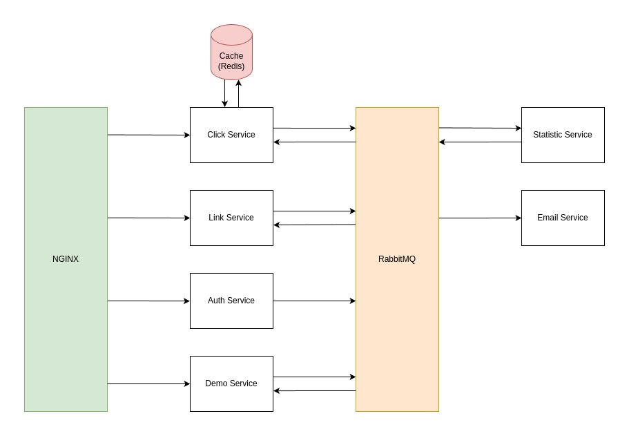
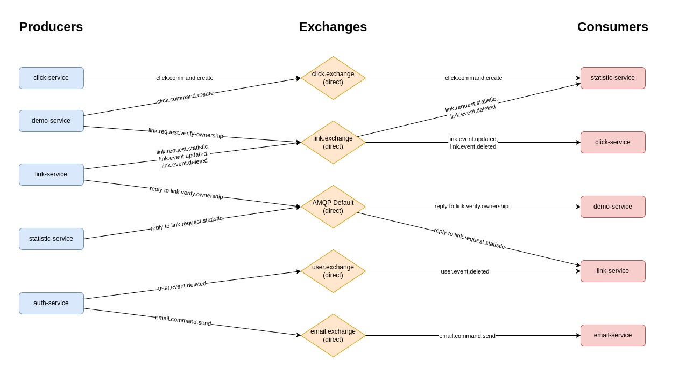

# Link Shortener

Link shortener application with comprehensive click analytics. The application gathers statistics about the browser, operating system and device from which the click was made.

[Demo](https://shortener.khodakovsky.com) allows you to create a demo account with demo data without the registration process, so feel free to check it out.

## Table of contents

-   [Screenshots](#screenshots)
-   [Built with](#built-with)
    -   [Common](#common)
    -   [Front End](#front-end)
    -   [Back End](#back-end)
-   [Architecture Overview](#architecture-overview)
    -   [Diagrams](#diagrams)
    -   [Documentation](#documentation)
    -   [Auth Service](#auth-service)
    -   [Link Service](#link-service)
    -   [Click Service](#click-service)
    -   [Demo Service](#demo-service)
    -   [Email Service](#email-service)
-   [How to run the application](#how-to-run-the-application)
-   [How to stop the application](#how-to-run-the-application)

<br>

## Screenshots













<br>

## Built with

### Common

-   TypeScript
-   NGINX
-   Docker
-   Swagger
-   Turborepo

### Front end

-   React
-   React Query
-   Formik
-   Chart.js
-   SASS / CSS modules
-   Mobile-first workflow
-   Vite

### Back end

-   NodeJS
-   NestJS
-   RabbitMQ
-   PostgreSQL
-   Redis
-   TypeORM
-   Express

<br>

## Architecture Overview

### Diagrams

Architecture diagram ([draw.io](./images/Architecture.drawio)):



RabbitMQ diagram ([draw.io](./images/RabbitMQ.drawio)):



### Documentation

Documentation:

-   [Swagger (Auth Service)](https://shortener.khodakovsky.com/api/auth/swagger)
-   [Swagger (Link Service)](https://shortener.khodakovsky.com/api/links/swagger)
-   [Swagger (Click Service)](https://shortener.khodakovsky.com/api/swagger)
-   [Swagger (Demo Service)](https://shortener.khodakovsky.com/api/demo/swagger)

### Auth Service

**Auth Service** is responsible for authentication and stores information about users.

Authentication is implemented using JWT with asymmetric encryption.

### Link Service

**Link Service** stores information about links.

### Click Service

**Click Service** redirects users from a short link to a destination link.

For each click **Click Service** generates an event with related information for further processing in the **Statistic Service**. Separation of redirection and click collection logic increases fault tolerance, allows asynchronous data processing, reduces redirect time and allows independent scaling.

Responses from **Link Service** are cached using **Redis** to reduce redirect time and reduce load on **Link Service**.

### Statistic Service

**Statistic Service** is responsible for collecting and storing information about clicks.

To reduce the load on the database, clicks are inserted using bulk insertion.

### Demo Service

**Demo Service** generates mock clicks for demo accounts.

### Email Service

**Email Service** is not yet implemented.

<br>

## How to run the application

To run the application you need to install [Docker](https://docs.docker.com/engine/install)

Run this command to verify that the installation is correct:

```console
docker -v
```

You should see something like this:

```console
Docker version 24.0.7, build afdd53b
```

Clone the repository:

```console
git clone https://github.com/NikitaKhodakovsky/link-shortener.git
```

Navigate to the directory with this repository:

```console
cd link-shortener
```

Execute the following command to start the application:

```console
docker compose --env-file ./.env.example up -d
```

The app is now available at http://localhost

### Database Schema Synchronization

If you are running this application for the first time, you should manually synchronize the database schema. You don't need to do this step for subsequent runs, because all data will be saved in named volumes.

Synchronize the schema of the **Auth Service**:

```
docker container exec -t link-shortener_auth-service sh -c "cd apps/auth-service && npm run typeorm:prod schema:sync"
```

Synchronize the schema of the **Link Service**:

```
docker container exec -t link-shortener_link-service sh -c "cd apps/link-service && npm run typeorm:prod schema:sync"
```

Synchronize the schema of the **Statistic Service**:

```
docker container exec -t link-shortener_statistic-service sh -c "cd apps/statistic-service && npm run typeorm:prod schema:sync"
```

For each of these commands, you should see the following result:

```console
Schema synchronization finished successfully.
```

<br>

## How to stop the application

To stop the application run:

```console
docker compose down
```
